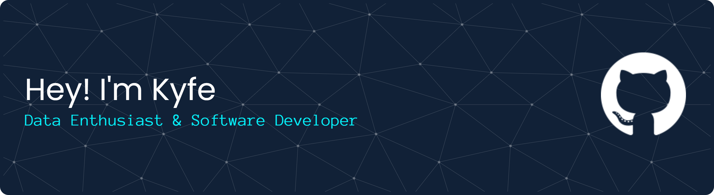

#### 💫 About Me:
🎓 Studying Information Systems at Universitas Mulawarman. 💡 Exploring Data Engineering and Software Development. 📚 Continuous learner actively participating in coding camps and technology webinars.

---

#### 💻 Tech Stack:

                      

---

#### 📊 GitHub Stats:

<picture data-importer="pacman">
  <source media="(prefers-color-scheme: dark)" srcset="https://raw.githubusercontent.com/maurodesouza/maurodesouza/pacman-output/pacman-contribution-graph-dark.svg?game=pacman">
  <source media="(prefers-color-scheme: light)" srcset="https://raw.githubusercontent.com/maurodesouza/maurodesouza/pacman-output/pacman-contribution-graph.svg?game=pacman">
  
</picture> 